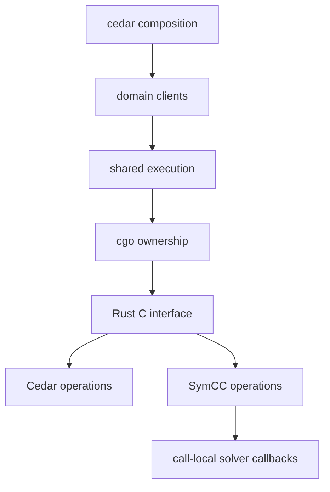

# Contributor lessons for cedar-go-wasm

Report bugs through GitHub issues. Report vulnerabilities through [SECURITY.md](SECURITY.md).
Use existing tools and dependencies. Obtain approval before installing a new tool or dependency.

## Package responsibilities

```text
cedar/                          Runtime composition and feature factories
  syntax/                       Cedar and JSON formats
  diagnostic/                   Errors, policy diagnostics, and source spans
  value/                        Values, expression results, and entity references
  entity/                       Entity records and collections
    uid/                        Entity identity
    store/                      Parsed entity snapshots, inspection, and graph edits
    slicing/                    Request-specific entity slicing
  schema/                       Schema sources, composition, and inspection
  policy/                       Policy sources, immutable snapshots, edits, and persistence
    template/                   Template sources, slots, and links
    format/                     Formatting and output limits
    source/                     Tokens and source spans
    applicability/              Potential request environments
    literal/                    Entity-literal inspection and substitution
  authorization/                Configuration and concrete authorization
    request/                    Requests, contexts, decisions, and responses
    batched/                    Call-local entity loading
    partial/                    Residual continuations, persistence, and reauthorization
      input/                    Unknown and known partial input records
      query/                    Permission query records and operations
  validation/                   Explicit strict validation and depth limits
  expression/                   Expression parsing and evaluation
  utility/                      Language and request utilities
  integration/                  Corpus and cross-feature verification
analysis/                       Stateless queries, compiled factory, and parent shutdown
  compiled/                     Compiled handles, serialized queries, and session shutdown
  options/                      Shared analysis configuration
  report/                       Public analysis results and errors
  solver/                       External solver processes and transport
  internal/lifetime/            Parent registration and pending constructor ownership
  internal/settings/            Private option state and defaults
  internal/transport/           Call-local solver callbacks and bounded error output
  internal/report/              Checked counterexample and diagnostic decoding
internal/
  execution/                    Scheduling, limits, and loaded session ownership
  native/                       Cgo interface, callbacks, and native lifetimes
  artifact/                     Native file and identity verification
  testsupport/                  Focused shared runtime, fixtures, corpus, and assertions
    generator/                  Rapid input generation and state-machine support
  verification/                 Source-linked native arithmetic checks
rust/crates/
  abi/                          Shared parsing, conversion, callbacks, and diagnostics
  authorizer/                   Explicit native Cedar state and domain operations
  analysis/                     Explicit native SymCC state and solver protocol
  native/                       Versioned C interface and ownership registries
  verification/                 Independent direct Cedar and SymCC fixture programs
```

Feature packages own their records, operations, and tests. They do not import the composition package.
Authorization child packages share internal session ownership. They do not import their parent implementation.
Partial input and permission-query packages do not own continuations.
Entity collections depend on values. Values depend on entity identity through `entity/uid`.
Policy sets own persistence. The template package uses policy sets without an inverse dependency.



Closing a runtime invalidates its clients. Closing a session waits for active native calls.
Private inputs and snapshots remain immutable. Display records cannot change a partial continuation.
Read the [native contract](docs/migration/native-contract.md) before changing resource ownership.

## Lesson 1: Build and check a source change

Objective: Verify native execution with pinned inputs.

1. Use Go 1.27.1, the pinned Rust toolchain, and a supported C compiler.
2. Commit source changes before building verified native artifacts.
3. Build the native archive and generated linker requirements.
4. Run formatting, static analysis, and Go tests.

```bash
CGO_ENABLED=1 scripts/build-native.sh
test -z "$(gofmt -l .)" || { gofmt -l .; exit 1; }
go vet ./...
go test -count=1 ./...
```

Worked example: The default command writes artifacts under `internal/native/_artifacts/` and installs only linker files for Go.

Knowledge check: Does a deadline stop active native CPU work? No. Read the cancellation contract before interpreting timeout tests.

## Lesson 2: Run complete verification

Objective: Preserve semantic and lifetime coverage before publication.

1. Set `CVC5` to the approved cvc5 1.3.1 executable.
2. Set `CEDAR_CORPUS_DIR` to the verified pinned corpus directory.
3. Run the exact local checks from CI against the final candidate.

```bash
set -euo pipefail
go test -count=1 -coverpkg=./... -coverprofile=coverage.out ./...
python3 scripts/check-coverage.py coverage.out
go test -race -count=1 ./...
GOEXPERIMENT=cgocheck2 go test -count=1 ./...
python3 scripts/fuzz/run.py
scripts/check-rust.sh
python3 -m unittest discover -s scripts/consumer -p 'test_*.py'
python3 -m unittest discover -s scripts/release -p 'test_*.py'
python3 -m unittest discover -s scripts/parity -p 'test_*.py'
python3 -m unittest discover -s scripts/fuzz -p 'test_*.py'
```

The fuzz runner requires the exact 25 target names and package paths.
It rejects missing, moved, duplicate, or unexpected targets. Each target runs for at least 60 seconds.
Use `FUZZTIME` and `FUZZWORKERS` for longer durations or worker changes.
The existing `FUZZ_SECONDS` and `FUZZ_WORKERS` inputs remain available.
The Rust script checks native tests, Clippy, independent fixtures, dependency policy, advisories, and license output.
Expected fixture files remain read-only. Use the relevant explicit update command only for an approved expectation change.

Worked example: `scripts/check-native-reproducibility.sh /tmp/native-artifact` compares two independent native builds.

Knowledge check: Can a missing tool or skipped check count as a pass? No. Resolve the missing check before pushing.

## Shared contracts and file size

Keep one implementation for each shared behavior.
Shared execution owns acquisition, cancellation checks, invalidation, and close ordering.
Shared wire checks reject invalid UTF-8. Domain decoders enforce their required fields and result variants.
Strict standard-library JSON encoding rejects malformed strings, duplicate names, and invalid nested values.
Raw JSON inputs retain preflight checks where error order or kind requires them.
Schema and policy sources share format vocabulary. Their snapshots retain distinct domain ownership.
Shared test support resolves fixture paths after package moves.

Analysis selection records remain distinct from schema applicability records because their accepted fields differ.
Analysis policy-evaluation reports require consistency checks beyond ordinary policy diagnostic decoding.
These distinctions preserve domain input and output contracts.

Target 150 lines per maintained code file. Rust inline tests can exceed the production-line target.
Before splitting a file, identify its separate responsibilities. Name each resulting file for its responsibility.
Document each necessary exception in the change report.
The [cleanup report](docs/refactor-46.md) records counts, responsibility reviews, interface changes, and verification.
The [migration report](docs/migration/verification.md) retains the earlier v0.2.0 evidence.

## Publication and releases

Run every applicable local CI check before pushing. Keep the exact repository-wide `gofmt` check.
Verify remote CI for the exact published main commit before tagging a release.
Release assets must contain the exact tested native files and consumer source bundle.
Follow [release maintenance](docs/maintenance.md) and the [consumer migration lessons](docs/migration/consumer.md).
